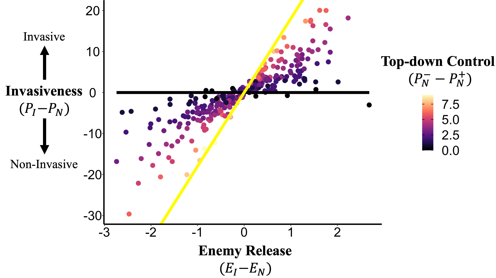
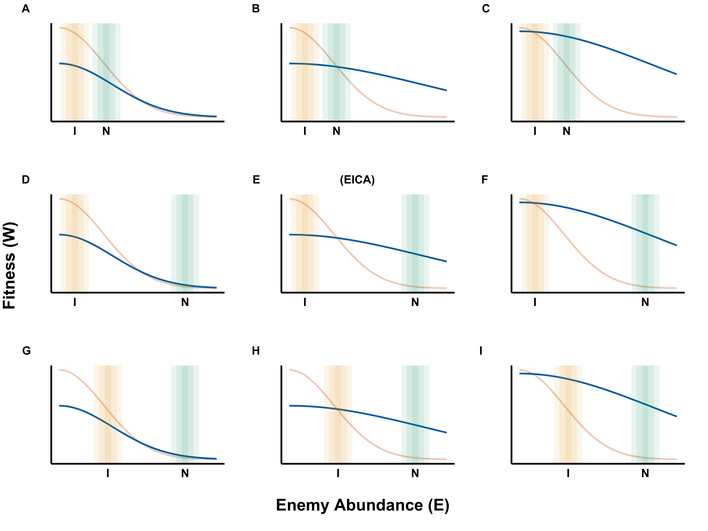

#### Here you can view examples of the images I have created in R

**Figure 1.** Prediction of enemy release as an important driver of species invasions, where invasiveness is predicted by a significant interaction between enemy release and top-down control. Each point represents an introduced species. The yellow line indicates the effect of enemy release given the maximum amount of top-down control observed, the black line indicates the effect of enemy release given no top-down control. Invasiveness and enemy release are treated as continuous variables with P representing population density, and E representing enemy abundance. Subscripts denote whether the trait was measured in the invasive (I) or native (N) range. Superscripts in the “top-down control” legend indicate density with enemies (+) and without enemies (–). 

&nbsp;

&nbsp;

&nbsp;

&nbsp;

**Figure 2.** Path analysis of *Alliaria petiolata* rosette size. Rosette size was mean standardized while other variables were z-standardized to give SD-standardized performance gradients. Arrows denote the direction of the effect; green arrows indicate a positive effect and red arrows indicate a negative effect. Arrow thickness denotes the magnitude of the effect and darker arrows indicate greater significance. General investment (PC1) denotes the production of both glucosinolates and chlorophyll A, while greater relative investment (PC2) values indicate more glucosinolate and less chlorophyll A production. TLA denotes the total leaf area of *Acer saccharum* at the end of year 1. The solid arrows connecting PC1 and PC2 to *A. petiolata* survival reflect direct selection on PC1 and PC2 through a direct mechanism, while the dashed arrows reflect direct selection on PC1 and PC2 through the indirect mechanism of affecting *Acer saccharum* TLA.

&nbsp;

&nbsp;

&nbsp;

&nbsp;

**Figure 3.** Example of machine learning performed in Python. The program identified the plant in the input images (top) and yielded the output images (bottom) to demonstrate which parts of the image have been identified as plant. I could then extract and store data pertaining to the plant. This program was run to obtain data from > 5000 images.

&nbsp;

&nbsp;

&nbsp;

&nbsp;

**Figure 4.** Mean growth rate of Garlic Mustard (*A.petiolata*), colored by genotype and distributed across competition treatments. Using data extracted from images of *A.petiolata* over a summer (example above), I was able to analyze growth rate in R. 

&nbsp;

&nbsp;

&nbsp;

&nbsp;

**Figure 5.** Proportion of women reporting cannabis consumption at some point in pregnancy (a), current consumption during pregnancy (b) and intent to consume cannabis while breastfeeding (c). Proportions are distributed across three levels of educational attainment, with and without partners who consume cannabis. For each group of women, coloured bars represent the proportion of women who reported the outcome and lines represent the 95% confidence intervals around each proportion. 

&nbsp;

&nbsp;

&nbsp;

&nbsp;

**Figure 6.** Fitness reaction norms for the relationship between enemy abundance (E) and fitness (W)
for a susceptible (light orange) and a resistant (blue) genotype. The three columns show different
scenarios in which the defence cost—benefit ratios are high (a,d,g), moderate (b,e,h) or low (c,f,i). The
three rows show different scenarios for variation in the abundance of enemies in the native (N, green)
and introduced ranges (I, yellow). Of these nine scenarios, only one supports the evolution of increased
competitive ability (EICA) in which natural selection for defence reverses between ranges (panel e).

&nbsp;

&nbsp;

&nbsp;

&nbsp;

**Figure 7.** Association of leaf quality (PC1) with *Alliaria petiolata* rosette size and
fecundity. Green circles denote *A. petiolata* plants grown in the alone treatment, orange squares
denote *A. petiolata* plants grown in the interspecific treatment and blue triangles denote
*A. petiolata* plants grown in the intraspecific treatment. The colored lines show the
estimated effect of leaf quality on rosette size and fecundity (i.e., selection gradients),
with color corresponding to treatment. In the case where the effect was not significant, a
slope of zero is shown to reflect the null hypothesis that the slope is equal to zero.

&nbsp;

&nbsp;

&nbsp;

&nbsp;

**Figure 8.** A general defence trade-off model of defence traits along a gradient of enemy abundance.
Fitness reaction norms (top row) show the relationship between enemy abundance (E) and fitness (W)
for five different genotypes with defence allocation ranging from low (light red) to moderate (green) to
high (dark blue). The three columns show different scenarios in which the defence cost—benefit ratios
are high (a,d), intermediate (b,e) or low (c,f). The bottom row shows the variance in fitness for each of
the three scenarios, with high variance corresponding to a rapid evolutionary response to selection.

&nbsp;

&nbsp;

&nbsp;

&nbsp;

**Figure 9.** Simulated data demonstrating the predicted relative fitness (W) when enemies are present (E+) and absent (E-) across a gradient of susceptible (red) and resistant (blue) genotypes. 

&nbsp;

&nbsp;

&nbsp;

&nbsp;

**Figure 10.** Linear approximations of reaction norms for fitness (W) measured in a susceptible (S, red) and a resistant genotype (R, blue). The difference in y-intercepts (WS0 – WR0) provides an estimate of the cost of resistance, while the slopes (–W0/E0) estimate of the benefits of defence.

&nbsp;

&nbsp;

&nbsp;

&nbsp;

**Figure 11.** Effect of competition on *A.petiolata* and *A.saccharum* under different competition regimes. 

