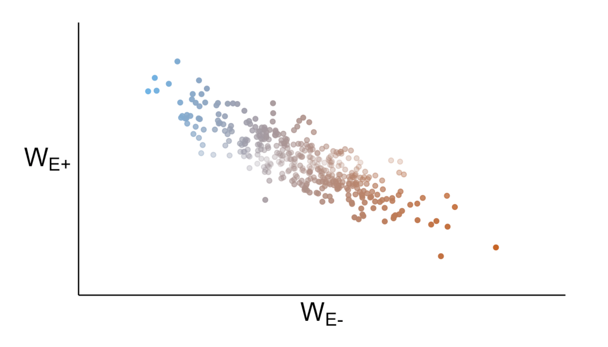

#### Here you can view examples of the images I have created in R

**Figure 1.** Mean growth rate of Garlic Mustard (*A.petiolata*), coloured by genotype and distributed across competition treatments. 

**Figure 2.** Fitness reaction norms for the relationship between enemy abundance (E) and fitness (W)
for a susceptible (light orange) and a resistant (blue) genotype. The three columns show different
scenarios in which the defence cost—benefit ratios are high (a,d,g), moderate (b,e,h) or low (c,f,i). The
three rows show different scenarios for variation in the abundance of enemies in the native (N, green)
and introduced ranges (I, yellow). Of these nine scenarios, only one supports the evolution of increased
competitive ability (EICA) in which natural selection for defence reverses between ranges (panel e).

**Figure 3.** Proportion of women reporting cannabis consumption at some point in pregnancy (a), current consumption during pregnancy (b) and intent to consume cannabis while breastfeeding (c). Proportions are distributed across three levels of educational attainment, with and without partners who consume cannabis. For each group of women, coloured bars represent the proportion of women who reported the outcome and lines represent the 95% confidence intervals around each proportion. 

**Figure 4.** Association of leaf quality (PC1) with *Alliaria petiolata* rosette size and
fecundity.Green circles denote *A. petiolata* plants grown in the alone treatment, orange squares
denote *A. petiolata* plants grown in the interspecific treatment and blue triangles denote
*A. petiolata* plants grown in the intraspecific treatment. The colored lines show the
estimated effect of leaf quality on rosette size and fecundity (i.e., selection gradients),
with color corresponding to treatment. In the case where the effect was not significant, a
slope of zero is shown to reflect the null hypothesis that the slope is equal to zero.

**Figure 5.** A general defence trade-off model of defence traits along a gradient of enemy abundance.
Fitness reaction norms (top row) show the relationship between enemy abundance (E) and fitness (W)
for five different genotypes with defence allocation ranging from low (light red) to moderate (green) to
high (dark blue). The three columns show different scenarios in which the defence cost—benefit ratios
are high (a,d), intermediate (b,e) or low (c,f). The bottom row shows the variance in fitness for each of
the three scenarios, with high variance corresponding to a rapid evolutionary response to selection.

**Figure 6.** Simulated data demonstrating the predicted relative fitness (W) when enemies are present (E+) and absent (E-) across a gradient of susceptible (red) and resistant (blue) genotypes. 

**Figure 7.** Linear approximations of reaction norms for fitness (W) measured in a susceptible (S, red) and a resistant genotype (R, blue). The difference in y-intercepts (WS0 – WR0) provides an estimate of the cost of resistance, while the slopes (–W0/E0) estimate of the benefits of defence.

**Figure 8.** Effect of competition on *A.petiolata* and *A.saccharum* under different competition regimes. 

 

