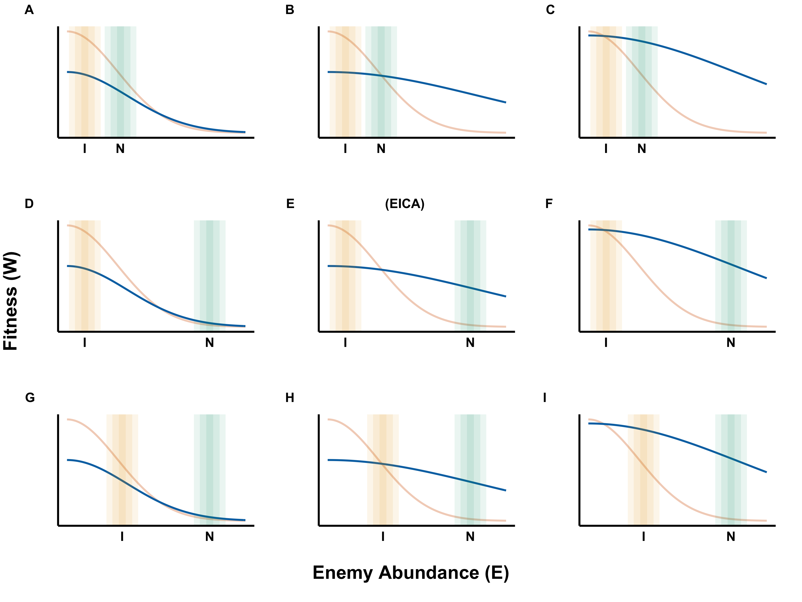

# Welcome to Richie Honor's portfolio! 

#### Here you can view the figures I have created, my data analyses and other examples of code that contributed to various projects. The links to my published works are also included as links when available. 

## **Gallery**

## **R Projects**

* **[Figure Generation for "EICA 2.0: A general theory of enemy release in plant invasions"](richiehonor.github.io/EICA2_SuppMat.html) *(published book chapter)*** 

*Description*

Here is the code used to generate the figures for my recently published (2020) chapter in the book ["Plant invasions: the role of biotic interactions"](https://www.cabi.org/cabebooks/ebook/20203555905). There also contains a few figures that were not used in the final manuscript, but were part of the process. 

 * **[Data analysis and visualization for "Assessing the prevalence and correlates of antenatal cannabis consumption in an urban Canadian population: A cross-sectional survey"](richiehonor.github.io/Kaarid_et_al_2021_SupplementaryMaterial.html) *(Scientific Article)***

*Description*

Here is the code used to perform the statistical analysis and generate the figures involved for this medical study. This was a collaboration between myself and medical researchers at McMaster University in Hamilton ontario. This article is currently in review with the journal [CMAJ Open](link.to.artical.when.available). 

 * **[Data integration for "Plasticity and evolutionary potential of *Alliaria petiolata* life history and leaf chemistry traits in different competitive environments"](richiehonor.github.io/AllData_Synthesis.html) *(MSc thesis)***

*Description*

Here is the code used to integrate 11 different data files into one file from which data analysis and visualization were performed (see below). This data was used in the publishing of my [master's thesis](https://qspace.library.queensu.ca/handle/1974/28610). 

